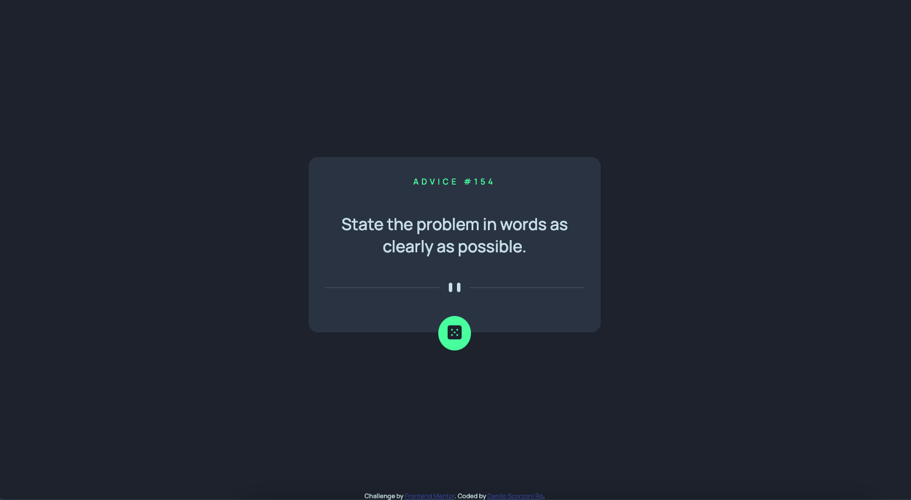
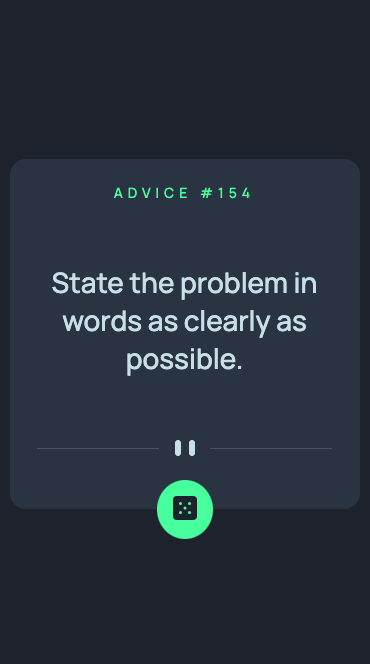

# Frontend Mentor - Advice generator app solution

This is a solution to the [Advice generator app challenge on Frontend Mentor](https://www.frontendmentor.io/challenges/advice-generator-app-QdUG-13db). Frontend Mentor challenges help you improve your coding skills by building realistic projects.

## Table of contents

- [Overview](#overview)
  - [The challenge](#the-challenge)
  - [Screenshot](#screenshot)
  - [Links](#links)
- [My process](#my-process)
  - [Built with](#built-with)
  - [What I learned](#what-i-learned)
  - [Useful resources](#useful-resources)
- [Author](#author)

## Overview

### The challenge

Users should be able to:

- View the optimal layout for the app depending on their device's screen size
- See hover states for all interactive elements on the page
- Generate a new piece of advice by clicking the dice icon

### Screenshot

Desktop solution:



Mobile solution:



### Links

- Solution URL: [Github Code](https://github.com/dscorzoni/project-advice-generator)
- Live Site URL: [Github Pages](https://dscorzoni.github.io/project-advice-generator/)

## My process

### Built with

- Semantic HTML5 markup
- CSS custom properties
- Flexbox
- Vanilla Javascript

### What I learned

In this project I learned how to use image rendering according to screen size using HTML directly, to adapt to desktop/mobile screens, as the code follows:

```html
<picture>
  <source
    media="(max-width: 500px)"
    srcset="images/pattern-divider-mobile.svg" />
  
</picture>
```

Also, another interesting thing that I learned was how to use simple API calls with fetch() on Javscript:

```javascript
const fetchData = () => {
  // Fecthing the random advice data
  fetch("https://api.adviceslip.com/advice")
    .then((response) => {
      return response.json();
    })
    .then((data) => {
      // Changing the content and header with new advice:
      quoteHeader.innerHTML = data.slip["id"];
      quoteText.innerHTML = data.slip["advice"];
    });
};
```

### Useful resources

- [How to fetch API data](https://www.digitalocean.com/community/tutorials/how-to-use-the-javascript-fetch-api-to-get-data) - A brief tutorial on how to use fetch to get API data in Javascript.

## Author

- Website - [Danilo Scorzoni Ré](https://www.github.com/dscorzoni)
- Frontend Mentor - [@dscorzoni](https://www.frontendmentor.io/profile/dscorzoni)
- LinkedIn - [@dscorzoni](https://www.linkedin.com/in/dscorzoni/)
